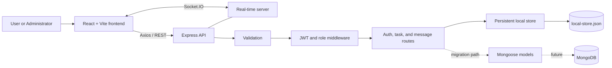
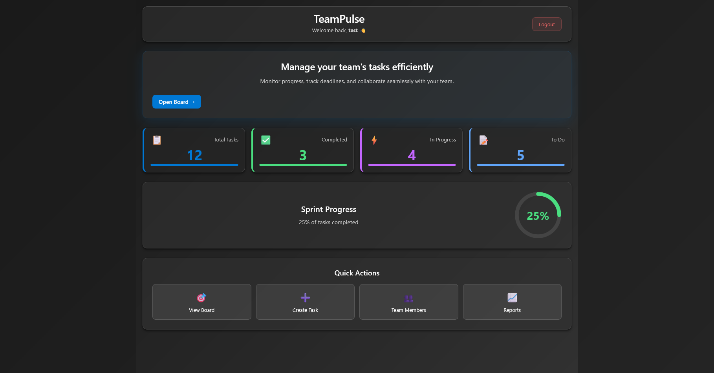
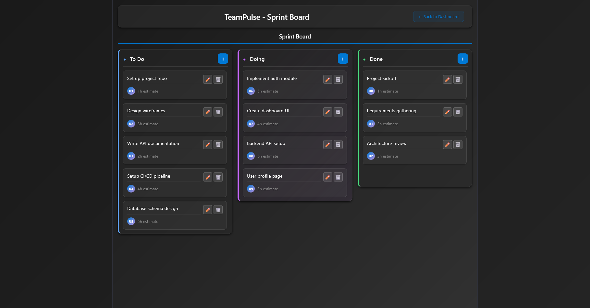
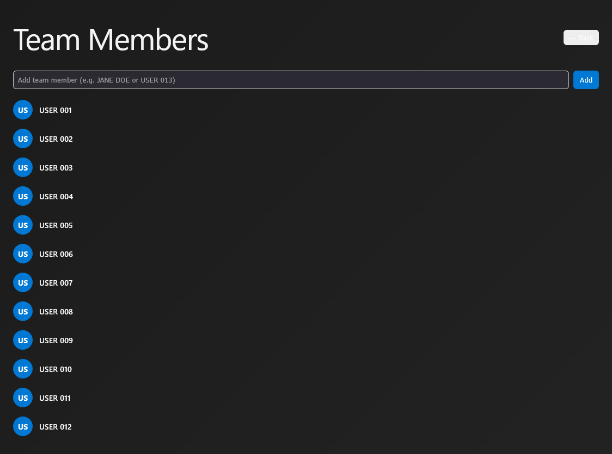
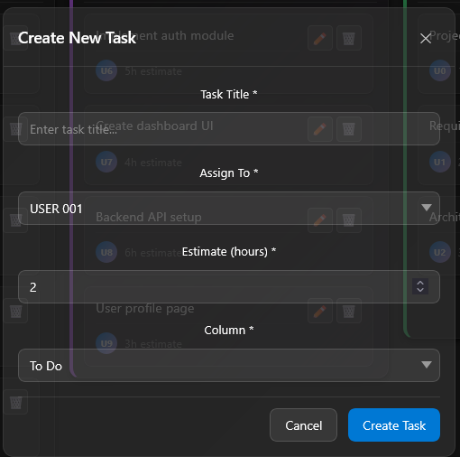
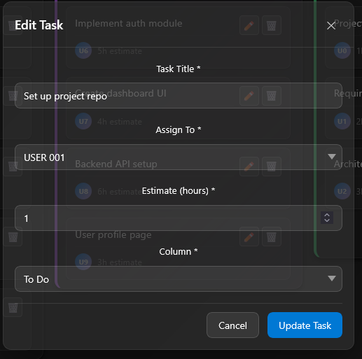
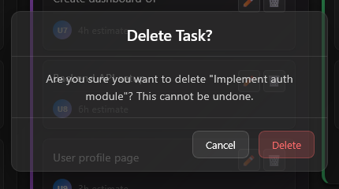
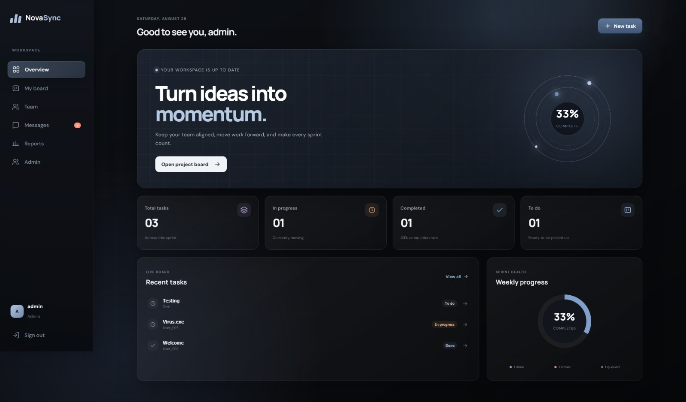

# NovaSync Full-Stack Development Report

> **Project type:** Task and team collaboration platform  
> **Frontend:** React 19 and Vite  
> **Backend:** Node.js, Express, Socket.IO, JWT, and persistent JSON storage  
> **Report purpose:** Document the complete development from the original interface to the current full-stack release

## 1. Executive Summary

NovaSync began as a frontend Kanban-board prototype with mock users, browser-based storage, and a small set of task-management screens. The current release is a connected full-stack application. It adds secure authentication, separate user and administrator experiences, backend task persistence, account and assignment management, saved team and direct messages, real-time communication, reporting, and a redesigned responsive interface.

The most important architectural change is that the frontend is no longer responsible for the complete application state. An Express API now validates requests and manages persistent data, while Socket.IO distributes live events between connected users.

## 2. Project Objectives

The development work focused on five objectives:

1. Convert the original UI prototype into a working client-server application.
2. Protect accounts and operations with authentication and role-based permissions.
3. Persist users, tasks, assignments, and message history outside the browser.
4. support real-time collaboration through chat, presence, and activity updates.
5. Improve the visual design and provide dedicated user and administrator workflows.

## 3. Technology Stack

| Layer | Technology | Responsibility |
|---|---|---|
| Frontend | React 19 | Pages, components, state, and user interaction |
| Build tooling | Vite | Development server and production build |
| Styling | CSS Modules and design tokens | Responsive light/dark user interface |
| HTTP client | Axios | REST API communication |
| Drag and drop | dnd-kit | Kanban task movement |
| Backend | Node.js and Express | REST endpoints, middleware, and business rules |
| Authentication | JWT and bcryptjs | Session tokens and password hashing |
| Validation | express-validator | Server-side request validation |
| Real-time layer | Socket.IO | Chat, presence, typing, and activity events |
| Current storage | Local JSON file store | Persistent users, tasks, and messages |
| Migration path | Mongoose models | Schemas prepared for future MongoDB use |

## 4. System Architecture



The Vite frontend runs on port `54995`. The Express and Socket.IO server runs on port `5000`. During development, Vite proxies API and Socket.IO traffic to the backend.

## 5. Original Version

The original version established the visual and functional foundation of the project:

- Login screen and dashboard shell
- Three-column Kanban board
- Task creation, editing, deletion, and drag-and-drop
- Team-member and report pages using mock data
- Browser local-storage persistence
- Basic light and dark themes

Its main limitations were the absence of real accounts, server-side authorization, shared persistence, live messaging, and administrator controls. Data was tied to the browser and could not provide a reliable shared workspace for multiple users.

### Original interface evidence

| Login | Dashboard |
|---|---|
|  |  |

| Board | Members |
|---|---|
|  |  |

| Create task | Edit task | Delete task |
|---|---|---|
|  |  |  |

### Original visual issues

The legacy screenshots also record theme and report-display issues that motivated later interface work.

| Light theme | Report dark-theme issue |
|---|---|
|  |  |

## 6. Current Release: What Is New

### 6.1 Authentication and account security

- Registration and login are handled by the backend.
- Passwords are hashed with bcrypt using a cost factor of 10.
- Successful login returns a signed JWT that expires after the configured period.
- Protected routes verify the bearer token before processing a request.
- User responses exclude password hashes.
- Administrator-only operations use an additional role check.

| User login | Administrator login |
|---|---|
|  |  |

### 6.2 Redesigned dashboard and navigation

The dashboard was updated into a workspace overview with clearer navigation, project information, activity, and quick access to collaboration features. The current styling is more consistent across pages and improves readability in the supported themes.



### 6.3 Improved Kanban task workflow

Task management still supports creating, editing, deleting, and moving cards, but operations are now connected to authenticated backend endpoints. Tasks can include priority, type, due date, estimate, assignee, board, and column information.

| Current task board | Create task |
|---|---|
|  |  |

| Edit task | Delete task |
|---|---|
|  |  |

### 6.4 Administrator control center

The release introduces a separate administrator workflow. Administrators can view users, create accounts, update account details and roles, delete accounts, assign tasks, and lock assignments. Self-protection rules prevent an administrator from deleting their own account or removing their own administrator access through restricted operations.

| Control center | Account creation |
|---|---|
|  |  |

| User team view | Administrator team view |
|---|---|
|  |  |

### 6.5 Reporting

An administrator-only reporting page provides project-level visibility while keeping privileged information out of the standard-user workflow.


### 6.6 Team and direct messaging

The application now provides two communication modes:

- **Team chat:** messages shared within a project and available from saved history.
- **Direct chat:** private conversation history between the signed-in user and another member.

Socket.IO delivers new messages without requiring a page refresh. It also supports online/offline presence, typing indicators, delivery events, and activity updates.

| Team chat | Direct chat |
|---|---|
|  |  |

## 7. Complete Change Summary

| Area | Original implementation | Current implementation |
|---|---|---|
| Application type | Frontend prototype | Full-stack collaboration application |
| User data | Generated/mock users | Persistent registered accounts |
| Authentication | Client-side demonstration | JWT authentication through Express |
| Password handling | No production-style credential flow | bcrypt password hashing |
| Authorization | UI-level role behavior | Server-enforced user and admin permissions |
| Tasks | Browser state/local storage | Authenticated REST API and persistent store |
| Assignments | Text-based assignee selection | User-linked assignment with admin locking |
| User management | Static member list | Administrator CRUD and role management |
| Messaging | Not part of the original workflow | Persistent team chat and direct messages |
| Real-time features | None | Socket.IO messages, presence, typing, and activity |
| Reports | Mock visualizations with theme issue | Dedicated administrator reports view |
| Error handling | Mainly frontend feedback | Validation, HTTP status codes, and central API errors |
| Storage | Browser local storage | Atomic local JSON persistence |
| Database preparation | None | Mongoose schemas for MongoDB migration |
| Development command | Frontend-only Vite command | Combined frontend and backend launcher |
| Interface | Early glass-style prototype | Expanded responsive user/admin experience |

## 8. Backend Implementation

### 8.1 Main components

```text
backend/
├── server.js             Express, HTTP, CORS, Socket.IO, startup and shutdown
├── config/database.js    Current persistent-store initialization
├── db/mockStore.js       JSON loading, seeding, serialization, and atomic writes
├── middleware/auth.js    JWT authentication and administrator authorization
├── routes/auth.js        Registration, login, profiles, users, and roles
├── routes/tasks.js       Task CRUD, assignment, and locking
├── routes/messages.js    Team/direct message history and sending
└── models/               User, Task, and Message Mongoose schemas
```

### 8.2 REST API

All protected endpoints require `Authorization: Bearer <token>`.

| Method | Endpoint | Access | Purpose |
|---|---|---|---|
| GET | `/api/health` | Public | Backend health status |
| POST | `/api/auth/register` | Public | Register a standard user |
| POST | `/api/auth/login` | Public | Authenticate and receive a JWT |
| GET | `/api/auth/me` | User | Get the signed-in user |
| GET | `/api/auth/users` | User | List safe user profiles |
| POST | `/api/auth/users` | Admin | Create an account |
| PUT | `/api/auth/users/:id` | Admin | Update an account |
| PATCH | `/api/auth/users/:id/role` | Admin | Change a role |
| DELETE | `/api/auth/users/:id` | Admin | Delete an account |
| GET | `/api/tasks` | User | List tasks, optionally by board |
| GET | `/api/tasks/:taskId` | User | Get one task |
| POST | `/api/tasks` | User | Create a task |
| PUT | `/api/tasks/:taskId` | User | Update an allowed task |
| PATCH | `/api/tasks/:taskId/assignment` | Admin | Assign and lock a task |
| DELETE | `/api/tasks/:taskId` | User | Delete an allowed task |
| GET | `/api/messages/team/:projectId` | User | Get team-message history |
| POST | `/api/messages/team` | User | Save and broadcast a team message |
| GET | `/api/messages/direct/:otherUserId` | User | Get a private conversation |
| POST | `/api/messages/direct` | User | Save and deliver a direct message |
| GET | `/api/messages/admin/team` | Admin | Review recent team messages |

### 8.3 Real-time events

| Client event | Server event | Purpose |
|---|---|---|
| `user:join` | `user:online` | Register and announce a connected user |
| — | `user:offline` | Announce a disconnected user |
| `message:team` | `message:team:received` | Broadcast a team message |
| `message:direct` | `message:direct:received` | Deliver a direct message |
| `message:direct` | `message:sent` | Confirm socket-based delivery attempt |
| `activity:update` | `activity:updated` | Share task activity |
| `user:typing` | `user:typing:indicator` | Display typing state |
| `user:stopTyping` | `user:stopTyping:indicator` | Clear typing state |

### 8.4 Persistence

The current backend deliberately initializes the local persistent store. Its data is written to `backend/data/local-store.json`. Updates are first written to a temporary file and then renamed, reducing the risk of a partially written main data file. Mongoose schemas are included, but MongoDB is not enabled in the current configuration.

## 9. Frontend Implementation

The frontend is organized into reusable components, pages, contexts, services, and API utilities:

```text
src/
├── api/client.js                 Axios requests and authorization headers
├── services/socketService.js     Socket.IO connection and event helpers
├── context/AuthContext.jsx       Authentication state
├── context/BoardContext.jsx      Board and task state
├── components/                   Board, columns, cards, forms, chat, and activity
├── pages/                        Login, admin login, dashboard, teams, reports, chat
├── styles/designTokens.css       Shared design values
└── App.jsx                       Main application composition and navigation
```

Important frontend changes include API-backed state, authenticated requests, user/admin page separation, messaging interfaces, workspace navigation, reusable dialogs, and consistent modular styles.

## 10. Security and Validation

The release adds the following protections:

- JWT verification for protected HTTP routes
- Separate administrator authorization middleware
- bcrypt password hashing
- Unique username and email checks
- Email, password, role, task, and message validation
- Password hashes removed from returned user objects
- Assignment-lock rules enforced by the backend
- Direct-message queries limited to conversation participants
- Configurable CORS origins
- Central JSON error responses
- Graceful server shutdown

Before production deployment, the example JWT secret must be replaced. HTTPS, rate limiting, security headers, authenticated Socket.IO handshakes, a transactional database, and automated tests are also recommended.

## 11. API Testing Evidence

The stored screenshots demonstrate the backend running and the main request categories being exercised.

| Backend server | Health endpoint |
|---|---|
|  |  |

| Authentication API | User API |
|---|---|
|  |  |

| Task API | Create task |
|---|---|
|  |  |

| Update and delete task | Message API |
|---|---|
| <br> |  |

Manual testing documents are included in `docs/Documents`. The current package scripts do not define an automated backend test suite, so this report does not claim automated test coverage.

## 12. Setup and Execution

### Requirements

- A current Node.js installation
- npm

### Installation

```bash
cp backend/.env.example backend/.env
npm install
npm --prefix backend install
npm run dev
```

The application is then available at:

- Frontend: `http://localhost:54995`
- Backend: `http://localhost:5000`
- Health check: `http://localhost:5000/api/health`

Set a strong private `JWT_SECRET` inside `backend/.env` before using the application outside local development.

## 13. Strengths and Current Limitations

### Strengths

- Clear separation between frontend, routes, middleware, storage, and real-time services
- End-to-end authentication and role-aware workflows
- Persistent task and message data
- Both team-wide and private real-time communication
- Dedicated administrator experience
- Reusable React components and modular styling
- Visual and API evidence covering the main system features

### Current limitations

- JSON persistence is intended for a prototype or single-server deployment.
- Socket.IO connections are not independently authenticated during the handshake.
- Some socket-only message events are not persistent; REST message routes are the authoritative saved path.
- Automated server and client tests are not included in the current scripts.
- Mongoose models exist, but the active configuration does not connect to MongoDB.
- Production deployment and CI/CD configuration are outside the current release.

## 14. Conclusion

NovaSync has progressed from a local frontend demonstration into a functional full-stack collaboration system. The current release connects the Kanban experience to authenticated server APIs, introduces persistent user and communication data, adds role-based administration, and enables live teamwork with Socket.IO. The before-and-after screenshots show the expansion in both interface quality and product scope, while the API evidence confirms that the frontend is supported by an operational backend.

The next logical release would focus on MongoDB migration, authenticated WebSocket connections, automated testing and CI, production security hardening, and deployment.
