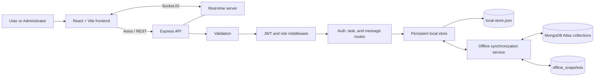
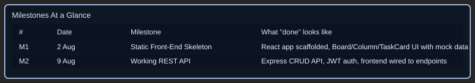

# NovaSync


[](https://github.com/ZeroTrace0245/Full-Stack-Development/actions/workflows/ci.yml)
[](https://full-stack-development-n0qo.onrender.com/)

**[Open NovaSync](https://full-stack-development-n0qo.onrender.com/)** · **[CI runs](https://github.com/ZeroTrace0245/Full-Stack-Development/actions/workflows/ci.yml)** · **[Deployment instructions](DEPLOYMENT.md)** · **[Final Final design gallery](#68-final-final-design)** · **[Hosting screenshots](#hosting-evidence)** · **[Local setup](#12-setup-and-execution)**

The CI badge turns green when the `main` workflow passes. The hosting badge turns
green when the homepage responds successfully; it does not verify login, messaging,
or Atlas synchronization. Render Free can sleep between visits, so a cold start
may temporarily show unavailable. Status badges reflect their providers' latest
checks and may be cached. See [Shields website status behavior](https://shields.io/badges/website).

NovaSync is a task and team collaboration platform with Kanban and timeline views, real-time messaging, and dedicated user and administrator workspaces. This report presents the **Final Final** interface, the development history, and the supplied deployment evidence.


### CI/CD and hosting

GitHub Actions installs both npm applications, lints the source, builds the Vite
frontend, runs the existing frontend unit tests, checks backend JavaScript syntax,
and tests production homepage/client-route serving while preserving API responses.
CI does not connect to the live Atlas database.

One Render Web Service serves the website, REST API, and Socket.IO at the same
origin. Configure **Auto-Deploy → After CI Checks Pass** to deploy after successful
GitHub checks.

| Render setting | Value |
|---|---|
| Root Directory | Leave blank (repository root) |
| Build Command | `npm ci --include=dev && npm ci --prefix backend --omit=dev && npm run build` |
| Start Command | `npm start` |
| Instance Type | Free |
| Health Check Path | `/api/health` |
| Environment | `NODE_ENV=production`, `NODE_VERSION=24`, `VITE_API_URL=/api`, `VITE_SOCKET_URL=/` |

Keep `MONGODB_URI`, `MONGODB_DB_NAME`, and `JWT_SECRET` in the service environment.
Check [API health](https://full-stack-development-n0qo.onrender.com/api/health) for
`atlas.connected`. Full setup and the existing local-storage/Atlas restart risk
are documented in [DEPLOYMENT.md](DEPLOYMENT.md). Pushing `render.yaml` does not
automatically reconfigure an existing manually created service.

### Hosting evidence

The screenshots captured on **10 September 2026** record the Render deployment and GitHub Actions workflow results for this release.

**Render deployment:** the dashboard shows **Deploy succeeded** for commit `bc76f4a`, a 35-second deployment duration, and the service URL in the startup logs. This deployment was triggered manually through the dashboard.


**GitHub Actions:** the workflow history shows successful runs, including **Node CI #5** for the same commit `bc76f4a` on `main`.


These images record deployment and CI status at capture time. Use the application and CI links above for subsequent status; a successful deployment alone does not establish Atlas synchronization or complete end-to-end functionality.

> **Project type:** Task and team collaboration platform  
> **Frontend:** React 19 and Vite  
> **Backend:** Node.js, Express, Socket.IO, JWT, offline-first JSON storage, and MongoDB Atlas synchronization  
> **Report purpose:** Document the complete development from the original interface to the current full-stack release

## 1. Executive Summary

NovaSync began as a frontend Kanban-board prototype with mock users, browser-based storage, and a small set of task-management screens. The current release is a connected full-stack application. It adds secure authentication, separate user and administrator experiences, backend task persistence, account and assignment management, saved team and direct messages, real-time communication, reporting, and a redesigned responsive interface.

The most important architectural change is that the frontend is no longer responsible for the complete application state. An Express API now validates requests and manages persistent data, while Socket.IO distributes live events between connected users.

## 2. Project Objectives

The development work focused on five objectives:

1. Convert the original UI prototype into a working client-server application.
2. Protect accounts and operations with authentication and role-based permissions.
3. Persist users, tasks, assignments, and message history outside the browser.
4. Support real-time collaboration through chat, presence, and activity updates.
5. Improve the visual design and provide dedicated user and administrator workflows.

## 3. Technology Stack

| Layer | Technology | Responsibility |
|---|---|---|
| Frontend | React 19 | Pages, components, state, and user interaction |
| Build tooling | Vite | Development server and production build |
| Styling | CSS Modules and design tokens | Responsive light/dark user interface |
| HTTP client | Axios | REST API communication |
| Drag and drop | dnd-kit | Kanban task movement |
| Backend | Node.js and Express | REST endpoints, middleware, and business rules |
| Authentication | JWT and bcryptjs | Session tokens and password hashing |
| Validation | express-validator | Server-side request validation |
| Real-time layer | Socket.IO | Chat, presence, typing, and activity events |
| Primary storage | Local JSON file store | Durable users, tasks, messages, and notifications |
| Cloud synchronization | MongoDB Atlas and Mongoose | Mirrored collections and a revisioned offline snapshot |

## 4. System Architecture



During local development, the Vite frontend runs on port `54995` and proxies API and Socket.IO traffic to the backend on port `5000`. In production, Express serves the built `dist` frontend and API on Render's assigned `PORT`; the browser uses the same origin for both.

## 5. Original Version

The original version established the visual and functional foundation of the project:

- Login screen and dashboard shell
- Three-column Kanban board
- Task creation, editing, deletion, and drag-and-drop
- Team-member and report pages using mock data
- Browser local-storage persistence
- Basic light and dark themes

Its main limitations were the absence of real accounts, server-side authorization, shared persistence, live messaging, and administrator controls. Data was tied to the browser and could not provide a reliable shared workspace for multiple users.

### Original interface evidence

| Login | Dashboard |
|---|---|
|  |  |

| Board | Members |
|---|---|
|  |  |

| Create task | Edit task | Delete task |
|---|---|---|
|  |  |  |

### Original visual issues

The legacy screenshots also record theme and report-display issues that motivated later interface work.

| Light theme | Report dark-theme issue |
|---|---|
|  |  |

**Original milestone overview**


**Original milestones at a glance**



## 6. Full-Stack Release and Latest Design Refresh

The screenshots in `Old` show the original prototype. `New` records the first full-stack interface, and `Refrash` records an intermediate refresh (the folder spelling is retained for working links). The newest supplied screenshots are in `final design` and appear in section 6.8. Earlier galleries remain as development history.

### 6.1 Authentication and account security

- Registration and login are handled by the backend.
- Passwords are hashed with bcrypt using a cost factor of 10.
- Successful login returns a signed JWT that expires after the configured period.
- Protected routes verify the bearer token before processing a request.
- User responses exclude password hashes.
- Administrator-only operations use an additional role check.

| User login | Administrator login |
|---|---|
|  |  |

### 6.2 Redesigned dashboard and navigation

The dashboard was updated into a workspace overview with clearer navigation, project information, activity, and quick access to collaboration features. The current styling is more consistent across pages and improves readability in the supported themes.


### 6.3 Improved Kanban task workflow

Task management still supports creating, editing, deleting, and moving cards, but operations are now connected to authenticated backend endpoints. Tasks can include priority, type, due date, estimate, assignee, board, and column information.

| Earlier full-stack task board | Create task |
|---|---|
|  |  |

| Edit task | Delete task |
|---|---|
|  |  |

### 6.4 Administrator control center

The release introduces a separate administrator workflow. Administrators can view users, create accounts, update account details and roles, delete accounts, assign tasks, and lock assignments. Self-protection rules prevent an administrator from deleting their own account or removing their own administrator access through restricted operations.

| Control center | Account creation |
|---|---|
|  |  |

| User team view | Administrator team view |
|---|---|
|  |  |

### 6.5 Reporting

An administrator-only reporting page provides project-level visibility while keeping privileged information out of the standard-user workflow.


### 6.6 Team and direct messaging

The application now provides two communication modes:

- **Team chat:** messages shared within a project and available from saved history.
- **Direct chat:** private conversation history between the signed-in user and another member.

Socket.IO delivers new messages without requiring a page refresh. It also supports online/offline presence, typing indicators, delivery events, and activity updates.

| Team chat | Direct chat |
|---|---|
|  |  |

### 6.7 Intermediate design refresh

The refresh extends the existing user and administrator workflows:

| Area | Current implementation |
|---|---|
| Task board | Search by task text/labels, priority and assignee filters, collapsible columns, focus mode, and an activity toggle |
| Create/edit task | Expanded task details including labels, progress, subtasks, relationships, and comments |
| Messages | Top navigation for Team chat, Direct messages, and Decisions |
| Decisions | Save team messages into a decision log; currently persisted in this browser's local storage |
| Reports | Current-board completion, workload, task types, overdue/blocker summaries, activity replay, and CSV export |
| Settings | User/admin profile editing, avatar, timezone, password changes, and preferences |
| Notifications | Administrator announcements, user-visible notifications, read tracking, and task-assignment alerts |
| Workspace navigation | Shared sidebar with account identity, role, settings access, and sign-out at the bottom |
| Backend terminal | Local-storage startup, Atlas connection/reconnection, and deferred-sync indicators |

The gallery below records the supplied refresh images. Screens without replacement images retain their earlier evidence above; this documentation update does not imply that every page has been redesigned. The lower-left sidebar shows account information, while the backend terminal and health endpoint provide Atlas connection status.

**Activities**


**Create task: first view**


**Create task: second view**


**Edit task: first view**


**Edit task: second view**


**Backend terminal Atlas connection indicators**


**Decision log**


**Administrator notification center**

.png>)

**Settings for users and administrators**


**Lower-left account and navigation area**


**User notifications**


**Refreshed reports and CSV export**


**Refreshed messaging: Team, Direct, and Decisions navigation**


**Refreshed task board: filters, focus mode, and activity toggle**


### 6.8 Final Final design

The latest supplied interface is documented in `docs/screenshots/Final Final`. It uses a dark blue and purple wallpaper, translucent cards, pale-blue actions, and a collapsible sidebar. The user workspace includes Overview, My board, Team, Messages, and Settings; the administrator sidebar also provides Reports and Admin.

The overview brings together task totals, recent tasks, overall progress, and upcoming deadlines. The gallery below covers the final user and administrator screens, task forms, collaboration tools, notifications, and Atlas connection indicators. Earlier images in this report document the development stages.

#### Sign in and registration

| Login | Create account |
|---|---|
|  |  |

#### User and administrator overviews

| User overview and navigation | Administrator overview and navigation |
|---|---|
|  |  |

#### Task planning

| Kanban board | Timeline view |
|---|---|
|  | .png>) |


#### Create and edit tasks

| Create task: part 1 | Create task: part 2 |
|---|---|
|  |  |

| Edit task: part 1 | Edit task: part 2 |
|---|---|
|  |  |

#### Messaging and decisions

| Chat | Decision log |
|---|---|
|  |  |

#### Team management

| Team: administrator view | Invite members |
|---|---|
| .png>) | .png>) |

.png>)

#### Administrator tools

| Control center | User accounts |
|---|---|
| .png>) | .png>) |

| Task security | Message audits |
|---|---|
| .png>) | .png>) |

.png>)

#### Notifications and settings

| Administrator notifications | User notifications |
|---|---|
| .png>) | .png>) |


#### Atlas connection states

| Checking connection | Atlas connected |
|---|---|
|  |  |


The connection indicators show the checking, connected, and disconnected UI states. They are capture-time evidence; inspect `/api/health` when checking a running instance.

## 7. Complete Change Summary

| Area | Original implementation | Current implementation |
|---|---|---|
| Application type | Frontend prototype | Full-stack collaboration application |
| User data | Generated/mock users | Persistent registered accounts |
| Authentication | Client-side demonstration | JWT authentication through Express |
| Password handling | No production-style credential flow | bcrypt password hashing |
| Authorization | UI-level role behavior | Server-enforced user and admin permissions |
| Tasks | Browser state/local storage | Authenticated REST API and persistent store |
| Assignments | Text-based assignee selection | User-linked assignment with admin locking |
| User management | Static member list | Administrator CRUD and role management |
| Messaging | Not part of the original workflow | Persistent team chat and direct messages |
| Real-time features | None | Socket.IO messages, presence, typing, and activity |
| Reports | Mock visualizations with theme issue | Dedicated administrator reports view |
| Error handling | Mainly frontend feedback | Validation, HTTP status codes, and central API errors |
| Storage | Browser local storage | Atomic local JSON persistence with Atlas synchronization |
| Database integration | None | Atlas collections, offline snapshots, and sync metadata |
| Notifications | None | Admin announcements, assignment alerts, and read tracking |
| Settings | Basic theme controls | Profile, password, avatar, and saved preferences |
| Decision log | None | Saved team-message decisions in browser local storage |
| Development command | Frontend-only Vite command | Combined frontend and backend launcher |
| Interface | Early glass-style prototype | Expanded responsive user/admin experience |

## 8. Backend Implementation

### 8.1 Main components

```text
backend/
├── .env.example              Placeholder configuration for local setup and Atlas
├── package.json              start, dev, and verify:sync scripts
├── package-lock.json         Backend dependency lockfile
├── server.js                 Express, health status, CORS, Socket.IO, lifecycle
├── config/
│   └── database.js           Local initialization, Atlas connection and retries
├── data/                     Runtime data (generated locally)
│   ├── local-store.json      Users, tasks, messages, and notifications
│   └── sync-state.json       Source ID, revision, dirty flag, collection hash
├── db/
│   └── mockStore.js          Durable JSON store, atomic writes, change listener
├── middleware/
│   └── auth.js               JWT verification and administrator authorization
├── models/
│   ├── User.js               User Mongoose schema
│   ├── Task.js               Task Mongoose schema
│   ├── Message.js            Message Mongoose schema
│   └── OfflineSnapshot.js    Revisioned snapshot in offline_snapshots
├── routes/
│   ├── auth.js               Authentication, profile updates, account management
│   ├── tasks.js              Task CRUD, assignment locks, assignment notifications
│   ├── messages.js           Saved team/direct messages and admin history
│   └── notifications.js      List, publish, mark read, and delete notifications
├── services/
│   └── offlineSync.js        Snapshot synchronization and collection mirroring
└── scripts/
    └── verify-sync.js        Connect to Atlas and print collection counts
```

### 8.2 REST API

All protected endpoints require `Authorization: Bearer <token>`.

| Method | Endpoint | Access | Purpose |
|---|---|---|---|
| GET | `/api/health` | Public | Backend status and Atlas configured/connected flags |
| POST | `/api/auth/register` | Public | Register a standard user |
| POST | `/api/auth/login` | Public | Authenticate and receive a JWT |
| GET | `/api/auth/me` | User | Get the signed-in user |
| PUT | `/api/auth/me` | User | Update profile, preferences, or password |
| GET | `/api/auth/users` | User | List safe user profiles |
| POST | `/api/auth/users` | Admin | Create an account |
| PUT | `/api/auth/users/:id` | Admin | Update an account |
| PATCH | `/api/auth/users/:id/role` | Admin | Change a role |
| DELETE | `/api/auth/users/:id` | Admin | Delete an account |
| GET | `/api/tasks` | User | List tasks, optionally by board |
| GET | `/api/tasks/:taskId` | User | Get one task |
| POST | `/api/tasks` | User | Create a task |
| PUT | `/api/tasks/:taskId` | User | Update an allowed task |
| PATCH | `/api/tasks/:taskId/assignment` | Admin | Assign and lock a task |
| DELETE | `/api/tasks/:taskId` | User | Delete an allowed task |
| GET | `/api/messages/team/:projectId` | User | Get team-message history |
| POST | `/api/messages/team` | User | Save and broadcast a team message |
| GET | `/api/messages/direct/:otherUserId` | User | Get a private conversation |
| POST | `/api/messages/direct` | User | Save and deliver a direct message |
| GET | `/api/messages/admin/team` | Admin | Review recent team messages |
| GET | `/api/notifications` | User | List visible notifications |
| POST | `/api/notifications` | Admin | Publish news, meeting, or important announcement |
| PATCH | `/api/notifications/:id/read` | User | Mark a visible notification as read |
| DELETE | `/api/notifications/:id` | Admin | Delete a notification |

### 8.3 Real-time events

| Client event | Server event | Purpose |
|---|---|---|
| `user:join` | `user:online` | Register and announce a connected user |
| — | `user:offline` | Announce a disconnected user |
| `message:team` | `message:team:received` | Broadcast a team message |
| `message:direct` | `message:direct:received` | Deliver a direct message |
| `message:direct` | `message:sent` | Confirm socket-based delivery attempt |
| `activity:update` | `activity:updated` | Share task activity |
| `user:typing` | `user:typing:indicator` | Display typing state |
| `user:stopTyping` | `user:stopTyping:indicator` | Clear typing state |
| — | `notification:new` | Deliver new announcements and task-assignment alerts |

### 8.4 Persistence and Atlas connections

The REST routes always read and write `backend/data/local-store.json`, even while Atlas is connected. `mockStore.js` is therefore the active durable store despite its historical name. Writes use a temporary file and rename before notifying the synchronization service.

When `MONGODB_URI` is configured, `config/database.js` connects through Mongoose and starts `services/offlineSync.js`. If the initial connection fails, the backend remains available using local storage and retries the connection. Omitting the URI keeps the backend local-only. This is backend offline operation; it does not make the browser independent of the API server.

The synchronization service mirrors `users`, `tasks`, `messages`, and `notifications` into Atlas. It also maintains one revisioned `offline_snapshots` document keyed by `novasync-primary`, containing the combined data. This is an updated snapshot, not a historical backup archive. `sync-state.json` tracks the source ID, last revision, dirty flag, and collection hash. Local changes schedule a sync after 250 ms; periodic synchronization defaults to 15 seconds. When local data is clean, the service can import changed Atlas collections or a newer snapshot. Dirty local data takes the upload path; there is no per-record conflict merge or transactional multi-collection synchronization.

The React app calls the Express REST API, and the backend connects to Atlas. There is no separate Atlas HTTP Data API integration in this codebase. An API success confirms the local operation; cloud synchronization happens afterward. `/api/health` reports connection flags, not proof that every record has synchronized.

### 8.5 Atlas connection and storage evidence

These supplied screenshots record the Atlas project, cluster, connection configuration, database views, metrics, local persistence files, and synchronized snapshot. They are development evidence rather than a live status check.

**Environment configuration evidence**


**Clusters**


**Connection string**


**Database**


**Atlas connection evidence**


**local-store**


**Messages collection**


**Metrics**


**Combined offline snapshot**


**Project**


**sync-state**


**Task Database**


**User database**


## 9. Frontend Implementation

The frontend is organized into reusable components, pages, contexts, services, and API utilities:

```text
src/
├── api/client.js                 Axios requests and authorization headers
├── services/socketService.js     Socket.IO connection and event helpers
├── context/AuthContext.jsx       Authentication state
├── context/BoardContext.jsx      Board and task state
├── components/                   Board, forms, chat, activity, navigation, notifications
├── pages/                        Login, admin login, dashboard, teams, reports, chat, settings
├── styles/designTokens.css       Shared design values
└── App.jsx                       Main application composition and navigation
```

Important frontend changes include API-backed state, authenticated requests, user/admin page separation, messaging interfaces, workspace navigation, reusable dialogs, and consistent modular styles.

## 10. Security and Validation

The release adds the following protections:

- JWT verification for protected HTTP routes
- Separate administrator authorization middleware
- bcrypt password hashing
- Unique username and email checks
- Email, password, role, task, and message validation
- Password hashes removed from returned user objects
- Assignment-lock rules enforced by the backend
- Direct-message queries limited to conversation participants
- Configurable CORS origins
- Central JSON error responses
- Graceful server shutdown

Before production deployment, the example JWT secret must be replaced. HTTPS, rate limiting, security headers, authenticated Socket.IO handshakes, a transactional database, and automated tests are also recommended.

## 11. API Testing Evidence

The stored screenshots demonstrate the backend running and the main request categories being exercised.

| Backend server | Health endpoint |
|---|---|
|  |  |

| Authentication API | User API |
|---|---|
|  |  |

| Task API | Create task |
|---|---|
|  |  |

| Update and delete task | Message API |
|---|---|
| <br> |  |

Manual testing documents are included in `docs/Documents`. The backend includes a `verify:sync` collection-count check, but the current package scripts do not define an automated backend test suite, so this report does not claim automated test coverage.

### 11.1 Atlas-backed API evidence

These captures pair Express API requests with Atlas database views: registration and the synchronized user, login, listing tasks, task creation and its database record, and task updates and their database record. They show the API-to-local-store-to-Atlas workflow rather than direct browser access to Atlas.

**API and Atlas Connection**


**Create task API request**


**Created task in Atlas**


**Updated task in Atlas**


**Get all task**


**Log in**


**Registered user synchronized to Atlas**


**Register a Test User**


**update task**


## 12. Setup and Execution

### Requirements

- Node.js 24 (aligned with the included CI and Render configuration)
- npm

### Installation

Copy the example configuration, then replace its placeholders before starting. For local-only operation, remove or leave `MONGODB_URI` empty. For Atlas synchronization, supply your database URI and database name in `backend/.env`; the frontend does not need database credentials.

```bash
cp backend/.env.example backend/.env
npm install
npm --prefix backend install
npm run dev
```

The application is then available at:

- Frontend: `http://localhost:54995`
- Backend: `http://localhost:5000`
- Health check: `http://localhost:5000/api/health`

Set a strong private `JWT_SECRET` inside `backend/.env` before using the application outside local development.

### Atlas configuration and verification

| Variable | Purpose / example |
|---|---|
| `MONGODB_URI` | Private MongoDB connection URI; empty for local-only mode |
| `MONGODB_DB_NAME` | Target database, for example `novasync` |
| `SYNC_INTERVAL_MS` | Periodic synchronization interval; default `15000` |
| `SYNC_RETRY_MS` | Initial failed-connection retry interval; default `15000` |
| `JWT_SECRET` / `JWT_EXPIRE` | Token signing secret and expiry (`7d` in the example) |
| `PORT` | Backend port, default `5000` |
| `SOCKET_IO_CORS` | Allowed frontend origins; example `http://localhost:54995` |

Use the URI for your Atlas database user, with password special characters URI-encoded, and configure Atlas network access for the backend host. Keep the real values in `backend/.env`.

After starting the app, inspect `GET /api/health` for `atlas.configured` and `atlas.connected`. Register/login through `/api/auth`, use the returned bearer token to create or update a task, then compare the returned ID with the corresponding Atlas record after synchronization. The supplied screenshots above illustrate these steps.

```bash
npm --prefix backend run verify:sync
```

This optional command connects to the configured database and prints counts for `users`, `tasks`, `messages`, and `offline_snapshots`. It does not check notifications, compare individual records, or prove complete synchronization. It requires a configured, reachable Atlas database.

## 13. Strengths and Current Limitations

### Strengths

- Clear separation between frontend, routes, middleware, storage, and real-time services
- End-to-end authentication and role-aware workflows
- Persistent task and message data
- Both team-wide and private real-time communication
- Dedicated administrator experience
- Reusable React components and modular styling
- Visual and API evidence covering the main system features

### Current limitations

- JSON persistence is intended for a prototype or single-server deployment.
- Socket.IO connections are not independently authenticated during the handshake.
- Some socket-only message events are not persistent; REST message routes are the authoritative saved path.
- CI runs frontend unit tests and production-serving tests; complete API, authentication, Socket.IO, and Atlas integration coverage remains outstanding.
- Atlas synchronization is asynchronous and uses snapshot/collection replacement without per-record conflict resolution.
- Decisions are browser-local; they are not part of the Atlas mirror.
- The refreshed reports summarize current board data; they are not a historical analytics backend.
- Render configuration and CI are included. Free hosting can sleep and discards local files on restart; the current sync logic can then overwrite Atlas with fresh local data. Use a disposable database until restoration is corrected.

## 14. Release Summary

NovaSync has progressed from a local frontend demonstration into a functional full-stack collaboration system. The current release connects the Kanban experience to authenticated server APIs, introduces persistent user and communication data, adds role-based administration, and enables live teamwork with Socket.IO. The before-and-after screenshots show the expansion in both interface quality and product scope, while the API evidence confirms that the frontend is supported by an operational backend.

Further work includes safe storage restoration after deployment restarts, synchronization conflict handling, shared decision persistence, authenticated WebSocket connections, and broader integration testing.
