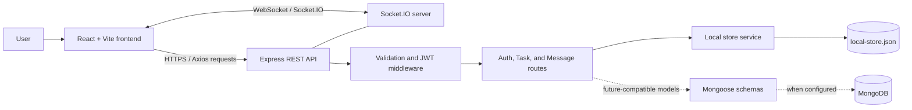
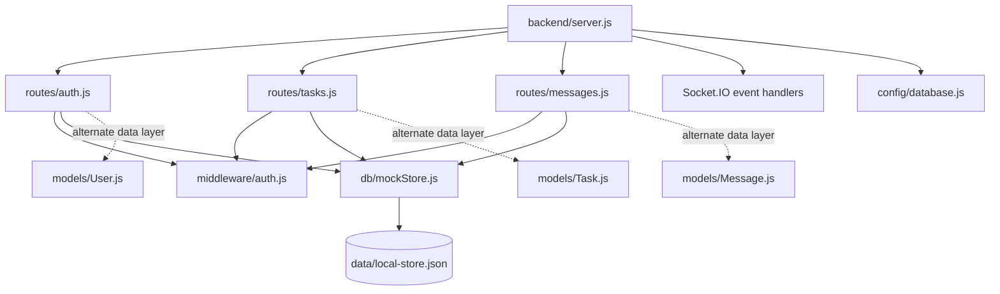
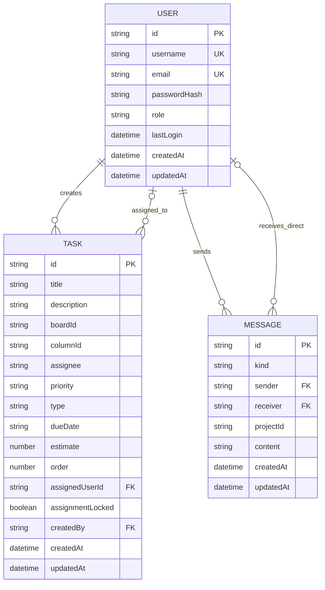
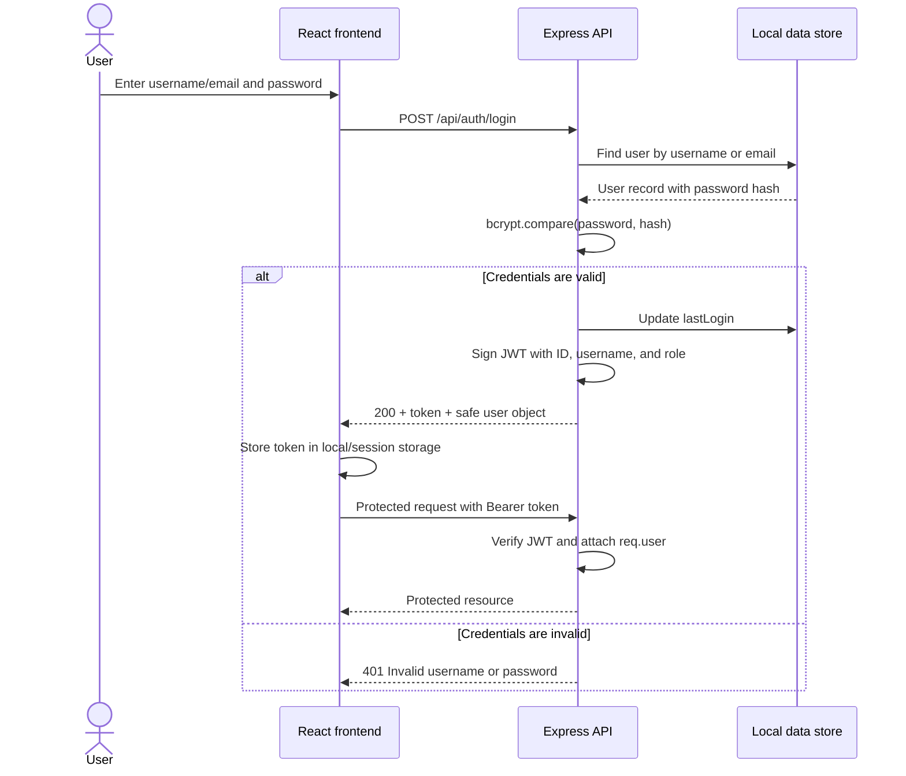
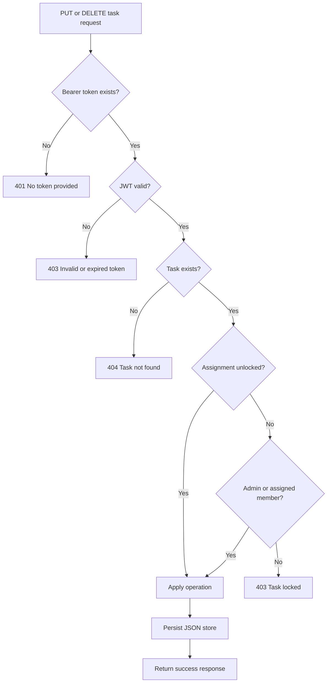
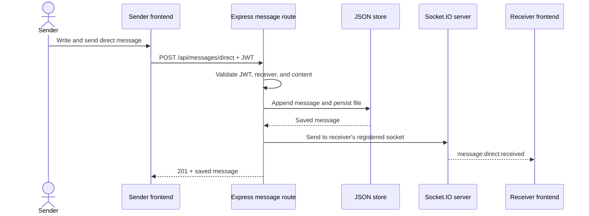

# NovaSync Backend Implementation Report

> **Project:** NovaSync task and team collaboration system  
> **Backend:** Node.js, Express, Socket.IO, JWT, bcryptjs  
> **Current persistence:** Local JSON file (`backend/data/local-store.json`)  
> **Prepared by:** _[Student name]_  
> **Date:** _[Submission date]_

## 1. Backend Overview

NovaSync uses a REST API for authentication, user administration, task management, and message history. Socket.IO provides real-time chat, presence, typing indicators, and activity updates. The React frontend communicates with the backend through Axios and a Socket.IO client.

The application currently stores data in a persistent local JSON file. Mongoose models for `User`, `Task`, and `Message` are also included in the codebase and define the intended MongoDB-compatible data model, but the current `database.js` configuration explicitly enables the local store.

### Technology stack

| Technology | Purpose |
|---|---|
| Node.js | JavaScript backend runtime |
| Express | REST API and middleware |
| Socket.IO | Real-time bidirectional communication |
| JSON file store | Current persistent storage |
| Mongoose | MongoDB-compatible schemas included for future use |
| JSON Web Token (JWT) | Authentication and role claims |
| bcryptjs | Password hashing and comparison |
| express-validator | Request validation |
| CORS | Restricts permitted frontend origins |

## 2. System Architecture



In development, Vite serves the frontend on port `54995` and proxies `/api` and `/socket.io` traffic to the Express server on port `5000`.

## 3. Backend Component Structure



## 4. Data Model

The logical relationships are shown below. In the current JSON implementation, identifiers are strings and relationships are maintained by matching ID values. In the Mongoose schemas, user references are represented with `ObjectId` fields.



### Main validation rules

- Usernames and email addresses must be unique.
- Passwords must contain at least six characters and are stored only as bcrypt hashes.
- Roles are limited to `Admin` and `Standard User`.
- Task priority is limited to `Low`, `Medium`, or `High`.
- Task type is limited to `Feature`, `Bug`, or `UI`.
- Messages must contain between 1 and 2,000 characters.
- Messages are either `team` or `direct` messages.

## 5. REST API Design

All protected endpoints expect the header `Authorization: Bearer <token>`. “Admin” means that both JWT authentication and the administrator middleware are required.

### Health and authentication

| Method | Endpoint | Access | Purpose | Main input |
|---|---|---|---|---|
| GET | `/api/health` | Public | Check whether the backend is running | None |
| POST | `/api/auth/register` | Public | Register a standard user and return a JWT | `username`, `email`, `password` |
| POST | `/api/auth/login` | Public | Authenticate using username/email and password | `identifier`, `password` |
| GET | `/api/auth/me` | Authenticated | Return the currently signed-in user | Bearer token |
| GET | `/api/auth/users` | Authenticated | List users without password hashes | Bearer token |
| PATCH | `/api/auth/users/:id/role` | Admin | Change a user's role | `role` |
| POST | `/api/auth/users` | Admin | Create a user | `username`, `email`, `password`, `role` |
| PUT | `/api/auth/users/:id` | Admin | Update a user and optionally their password | `username`, `email`, `role`, optional `password` |
| DELETE | `/api/auth/users/:id` | Admin | Delete a user and release assigned tasks | User ID |

### Task endpoints

| Method | Endpoint | Access | Purpose | Main input |
|---|---|---|---|---|
| GET | `/api/tasks?boardId=:id` | Authenticated | List tasks, optionally filtered by board | Optional `boardId` query |
| GET | `/api/tasks/:taskId` | Authenticated | Retrieve one task | Task ID |
| POST | `/api/tasks` | Authenticated | Create a task | Required `title`, `columnId`; optional task fields |
| PUT | `/api/tasks/:taskId` | Authenticated | Update permitted task fields | Task fields |
| PATCH | `/api/tasks/:taskId/assignment` | Admin | Assign and optionally lock a task | `assignedUserId`, `assignmentLocked` |
| DELETE | `/api/tasks/:taskId` | Authenticated | Delete a task when assignment rules permit | Task ID |

### Message endpoints

| Method | Endpoint | Access | Purpose | Main input |
|---|---|---|---|---|
| GET | `/api/messages/admin/team?limit=100` | Admin | Read recent team messages across projects | Optional `limit`, maximum 250 |
| GET | `/api/messages/team/:projectId?limit=50` | Authenticated | Read a project's team-message history | Project ID; maximum 100 |
| POST | `/api/messages/team` | Authenticated | Persist and broadcast a team message | `projectId`, `content` |
| GET | `/api/messages/direct/:otherUserId?limit=50` | Authenticated | Read conversation history with one user | Other user ID; maximum 100 |
| POST | `/api/messages/direct` | Authenticated | Persist and send a direct message | `receiverId`, `content` |

### Typical HTTP status codes

| Code | Meaning in this API |
|---|---|
| 200 | Request completed successfully |
| 201 | User, task, or message created successfully |
| 400 | Invalid input or prohibited self-operation |
| 401 | Missing credentials or invalid login details |
| 403 | Invalid/expired token, insufficient role, or locked task |
| 404 | Requested user, task, or recipient was not found |
| 409 | Username or email already exists |
| 500 | Unexpected server error |

## 6. Authentication Flow



## 7. Task Update and Authorization Flow



## 8. Real-Time Messaging Flow

Messages posted through the REST API are persisted before being emitted through Socket.IO. The server also supports client-originated Socket.IO events for presence, chat, typing indicators, and activity updates.



### Socket.IO events

| Client event | Server event | Purpose |
|---|---|---|
| `user:join` | `user:online` | Register socket and broadcast presence |
| — | `user:offline` | Notify users after a disconnection |
| `message:team` | `message:team:received` | Broadcast a team-chat message |
| `message:direct` | `message:direct:received` | Deliver a message to an online recipient |
| `message:direct` | `message:sent` | Confirm socket-based sending to sender |
| `activity:update` | `activity:updated` | Broadcast task activity |
| `user:typing` | `user:typing:indicator` | Show typing state |
| `user:stopTyping` | `user:stopTyping:indicator` | Clear typing state |

## 9. Important Implementation Details

### Password protection and token creation

Passwords are hashed with a cost factor of 10. JWTs contain the user's ID, username, and role, and expire after seven days by default.

```js
const passwordHash = await bcryptjs.hash(password, 10)

jwt.sign(
  { userId, username, role },
  process.env.JWT_SECRET,
  { expiresIn: process.env.JWT_EXPIRE || '7d' }
)
```

### Atomic local persistence

The store writes the complete state to a temporary file and then renames it to the main data file. This reduces the chance of leaving a partially written JSON file.

```js
export function persistStore() {
  mkdirSync(dirname(storePath), { recursive: true })
  const temporaryPath = `${storePath}.tmp`
  writeFileSync(temporaryPath, JSON.stringify(mockStore, null, 2), 'utf8')
  renameSync(temporaryPath, storePath)
}
```

### Central error response

Unhandled route errors are passed to one Express error middleware, which returns a consistent JSON response.

```js
app.use((err, req, res, next) => {
  res.status(err.status || 500).json({
    error: err.message || 'Internal Server Error',
    timestamp: new Date().toISOString()
  })
})
```

## 10. Security and Error Handling

- Password hashes are omitted from API user responses.
- Protected routes verify JWTs before executing route logic.
- Administrator middleware protects role management, user management, task assignment, and global team-message access.
- Input validation rejects malformed emails, short passwords, empty task titles, and invalid messages.
- A user cannot remove their own administrator role or delete their own administrator account.
- Locked tasks can only be changed by an administrator or their assigned member.
- CORS accepts configured origins and local-network development addresses on the frontend port.
- Direct-message history queries include only messages where the signed-in user is one of the two participants.
- Graceful shutdown closes the data connection abstraction and HTTP server.

> **Production recommendation:** Set a strong `JWT_SECRET`; use HTTPS; replace the JSON store with a transactional database; add rate limiting, security headers, Socket.IO authentication, structured logging, and automated tests. The fallback JWT secret in the source code must not be used in production.

## 11. Testing and Evidence

The following tests can be performed with Postman, Insomnia, or the browser. Replace each placeholder with a screenshot taken from the running application. Screenshots should show the request, response status, and response body, but must not expose passwords or full JWTs.

| Test | Procedure | Expected result | Evidence to insert |
|---|---|---|---|
| Health check | `GET /api/health` | `200` with running status and timestamp | `` |
| Valid login | Submit known username/email and password | `200`, JWT, and user without `passwordHash` | `` |
| Invalid login | Submit an incorrect password | `401` error | `` |
| Protected endpoint | Request `/api/auth/me` with Bearer token | `200` and current user | `` |
| Input validation | Register with a password shorter than six characters | `400` validation response | `` |
| Create task | `POST /api/tasks` with valid token and task data | `201` and stored task | `` |
| Authorization | Standard user calls an admin endpoint | `403` administrator error | `` |
| Persistence | Create data, restart server, fetch it again | Previously created data remains | `` |
| Real-time chat | Open two sessions and send a message | Other session receives it immediately | `` |

### Example requests

```http
POST /api/auth/login HTTP/1.1
Content-Type: application/json

{
  "identifier": "admin",
  "password": "[REDACTED]"
}
```

```http
POST /api/tasks HTTP/1.1
Authorization: Bearer <token>
Content-Type: application/json

{
  "title": "Prepare project report",
  "columnId": "in-progress",
  "boardId": "board-1",
  "priority": "High",
  "type": "Feature"
}
```

```http
POST /api/messages/team HTTP/1.1
Authorization: Bearer <token>
Content-Type: application/json

{
  "projectId": "board-1",
  "content": "The backend report is ready for review."
}
```

### Test status note

The repository contains manual testing documentation but no automated backend test script in `backend/package.json`. Therefore, this report should not claim automated test coverage unless a test suite is added and executed. Record actual status codes and results beside the screenshots before submission.

## 12. Backend Strengths and Limitations

### Strengths

- Clear separation between routes, middleware, models, storage, and server setup.
- Stateless JWT authentication for REST requests.
- Role-based protection for administrative functions.
- Persistent messages and tasks combined with real-time delivery.
- Validation and consistent error responses.
- MongoDB-compatible schemas provide a migration path from local storage.

### Current limitations

- The JSON file store is best suited to a prototype or single-server deployment.
- File writes are synchronous and there is no multi-process concurrency control.
- Socket.IO event handlers do not independently authenticate socket connections.
- Some socket-only message events broadcast without persistence; the REST message routes should be the authoritative path when history is required.
- Automated backend tests and measured performance results are not currently included.
- Mongoose schemas are present, but the current configuration always selects local JSON storage.

## 13. Conclusion

The NovaSync backend provides authenticated user and task management, role-based administration, persistent message history, and real-time collaboration. Its layered structure makes the API understandable and maintainable, while the Mermaid diagrams explain how the frontend, REST routes, security middleware, data store, and Socket.IO server interact. For a production deployment, the main next steps are enabling a database such as MongoDB, authenticating socket connections, strengthening deployment security, and adding automated integration tests.

## Appendix: Suggested Screenshot Checklist

Add only clear, relevant evidence rather than screenshots of entire source files:

1. Terminal showing the backend running on port `5000`.
2. Successful `/api/health` response.
3. Successful login with the JWT mostly hidden.
4. Rejected request without a token.
5. Successful task creation and the matching stored record.
6. Administrator-only action succeeding and standard-user attempt failing.
7. Two browser windows demonstrating real-time messaging.
8. A small, readable code screenshot only if the marking rubric specifically requires source-code evidence.
